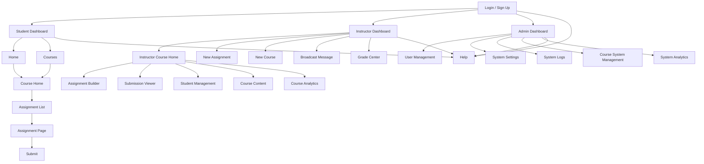

# Site Map (Frontend Pages)

```mermaid
flowchart TD
    L[Login / Sign Up] --> SD[Student Dashboard]
    L --> ID[Instructor Dashboard]
    L --> AD[Admin Dashboard]
    
    SD --> H[Home]
    SD --> C[Courses]
    H --> CH[Course Home]
    C --> CH
    CH --> AL[Assignment List]
    AL --> AP[Assignment Page]
    AP --> SUB[Submit]
    
    ID --> IC[Instructor Course Home]
    ID --> NA[New Assignment]
    ID --> NC[New Course]
    ID --> BM[Broadcast Message]
    ID --> GC[Grade Center]
    IC --> AB[Assignment Builder]
    IC --> SV[Submission Viewer]
    IC --> SM[Student Management]
    IC --> CM[Course Content]
    IC --> CA[Course Analytics]
    
    AD --> UM[User Management]
    AD --> SS[System Settings]
    AD --> SL[System Logs]
    AD --> CSM[Course System Management]
    AD --> SA[System Analytics]
    
    L --> HELP[Help]
    SD --> HELP
    ID --> HELP
    AD --> HELP
```